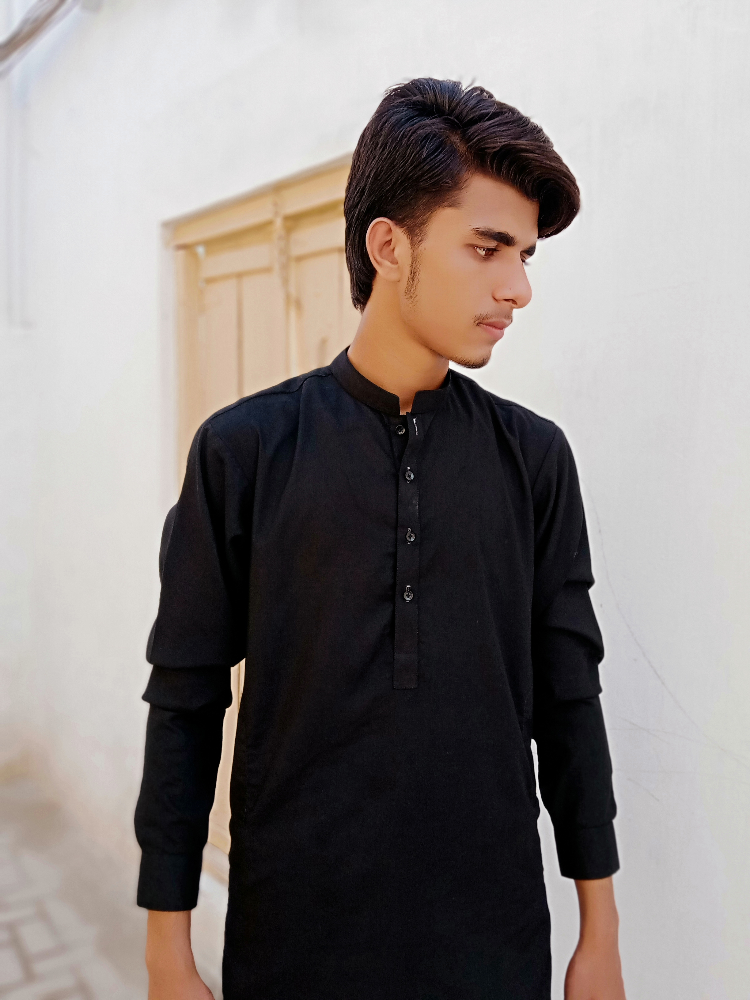

# My-cv.com
<Html>     
<Head>      
<Title>     

</Title>  
</Head>  
<Body> 
 

<head><title>My CV </title></head>
<body bgcolor="white">
    
<h1><b>ALI AHMAD </b></h1>            
<address style="color:black;"> aliahmadqure@gmail.com</address>
<h2 style="color:black;">CAREER OBJECT:</h2>
Want to be the part of a software developer organization and utilize my knowledge,Skills
and expertise to contribute  towards organization and professional
brilliance and to learn more with the passage of time from all 
types of situations and circumstances.
<h2 style="color:black;">EDUCATION AND QUALIIFICATIONS:</h2>
<table border="2" cellspacing="5" cellpadding="5" >
<tr>
    <th>Qualification</th>
    <th>Maximun Marks</th>
    <th>Obtained Marks</th>
    <th>Division</th>
    <th>Institution</th>
    <th>Bord/University</th>
</tr
<tr>
    <td>BSIT continue </td>
    <td>4 GPA</td>
    <td>2.75 GPA</td>
    <td>B+</td>
    <td>GHazi university dera ghazi khan , DG khan</td>
    <td>University </td>
</tr>
<tr>
    <td>FSC </td>
    <td>1100</td>
    <td>951</td>
    <td>A+</td>
    <td>Govt degree college jampur </td>
     <td>DG khan Board</td>
</tr>
<tr>
    <td>Matric(computer)</td>
    <td>1100</td>
    <td>927</td>
    <td>A+</td>
    <td>Govt model hidh school jampur </td>
    <td>DG khan board </td>
</tr>
<tr>
    <td>8th </td>
    <td>500</td>
    <td>382</td>
    <td>A+</td>
    <td>ALSHMAS PUBLIC SCHOOL JAMPUR</td>
    <td>DG khan board </td>
</tr>
</table>
<h2 style="color:black;">TECHNICAL EXPERIENCE:</h2>

      Languages:                  C, C++, JAVA, HTML  
      Platforms:                  Windows Seven, Linux  
      Concepts:                   Networking, operating systems
<h2 style="color:black;">ABILITIES:</h2>
      Skill Level :                 MS Word, MS Excel, Power point  
      practiced :                  More than 1 years
<h2 style="color:black;">PERSONAL SKILLS:</h2>
                                  1.Honesty 
                                  2.Team Spirit 
                                  3.Accepting Challenges
<h2 style="color:black;">LANGUAGES:</h2>
                                  Urdu,English               
<h2 style="color:black;">INTEREST:</h2>
                                  1.Internet browsing
                                  2.Reading books
<h2 style="color:black;">REFERENCE:</h2>
                                Will be provided on demand
</body>
</html> 

</Body>   
</Html>
